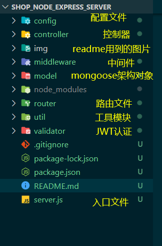
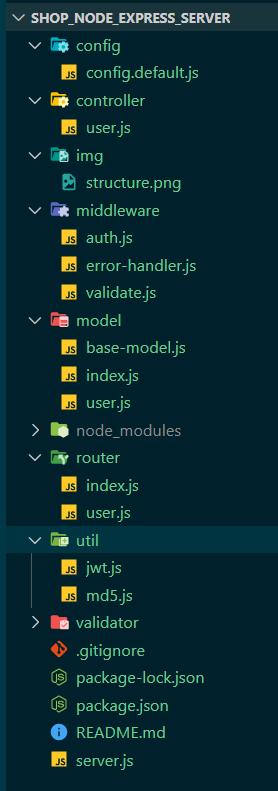

# 购物网站

### 一.项目简介
#### 描述
这是一个纯学习，实践的项目。

#### 模式
node + express + mongodb

#### 目的
为前端练习项目提供API保障，便于实践，提升。

### 二.搭建项目基础
#### 安装
##### 创建并进入项目目录
```sh
# 创建项目目录
mkdir xxx
# 进入项目目录
cd xxx
```

##### 初始化项目
```sh
# npm init 生成项目描述文件，package.json
npm init -y
```

##### 项目初始目录结构
暂时创建基本目录，随着需要增加，在修改。




##### 加入一些基本第三方包
```sh
# express 框架
npm i express

# 为客户端提供跨域请求
npm i cors

# morgan 处理日志
npm i morgan

# mongoose 连接MongoDB数据库
npm i mongoose

# express-validator 用于数据验证（校验）
npm i express-validator

# jsonwebtoken基于node环境的JWT认证
npm i jsonwebtoken

```

##### 入口文件
创建入口文件`server.js`
基本：
```js
// 导入模块
const express = require('express')
const morgan = require('morgan')
const router = require('./router')
const cors = require('cors')
const errorHandler = require('./middleware/error-handler')
require('./model')

// 获取服务器端口
const PORT = process.env.PORT || 5000

// 创建服务器应用
const server = express()

// 解析请求体
server.use(express.json())

// 使用中间件,用于输出日志
server.use(morgan('dev'))

// 为客户端提供跨域资源请求
server.use(cors())

server.all('*',(req, res, next) => {
  res.setHeader('Content-Type','application/json;charset=utf-8')
  next()
})

// 挂载路由,以api作为前缀
server.use('/api',router)

// 错误处理,必须放到路由后面
server.use(errorHandler())

server.listen(PORT,() => {
  console.log(`serve running at port http://localhost:${PORT} ...`)
})

```

##### 基本用法

[基础用法](mddoc/基本用法.md)

##### RESTfull规范

[RESTfull规范](mddoc/RESTfull规范.md)

##### express环境搭建概况

[express环境搭建概况](mddoc/express环境搭建.md)

##### 项目开始之用户登录和注册及验证

[用户登录和注册及身份验证](mddoc/用户登录注册及身份验证.md)
